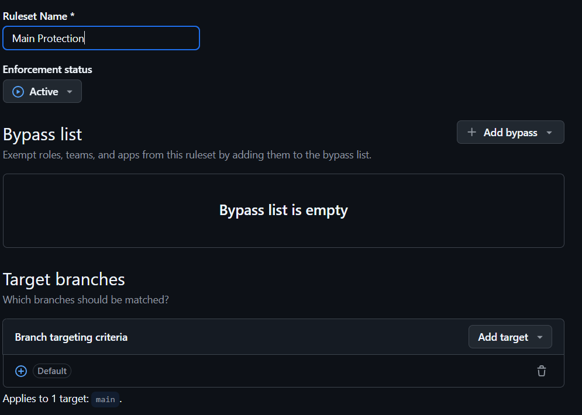
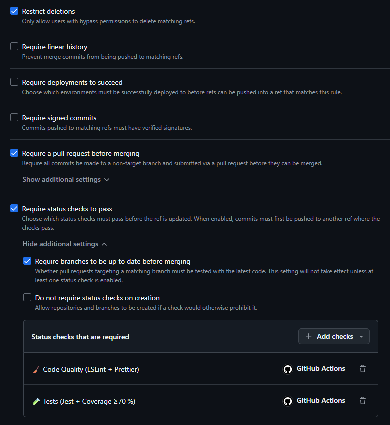
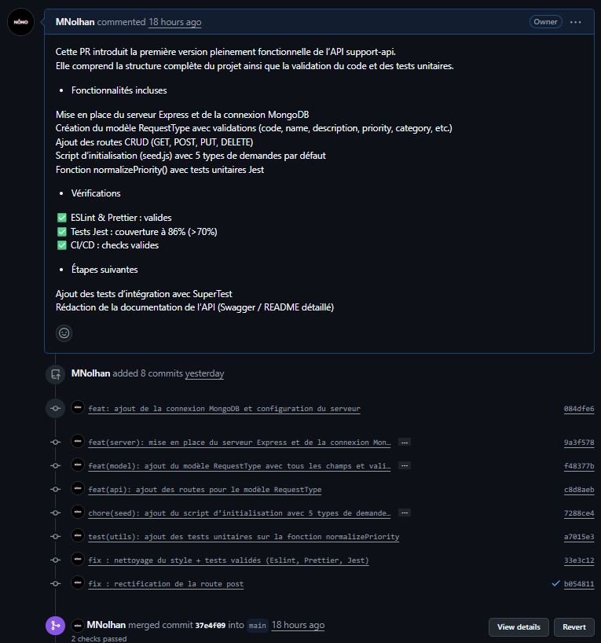
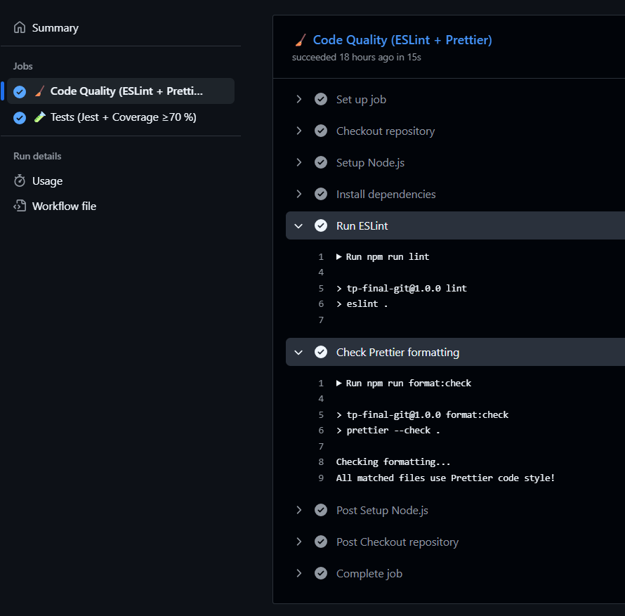
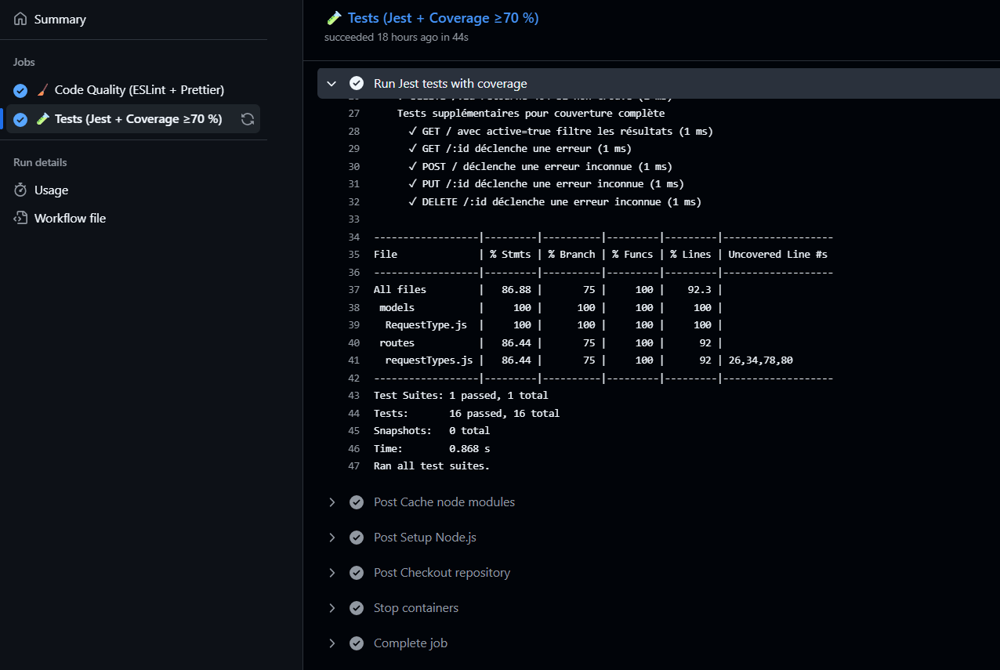
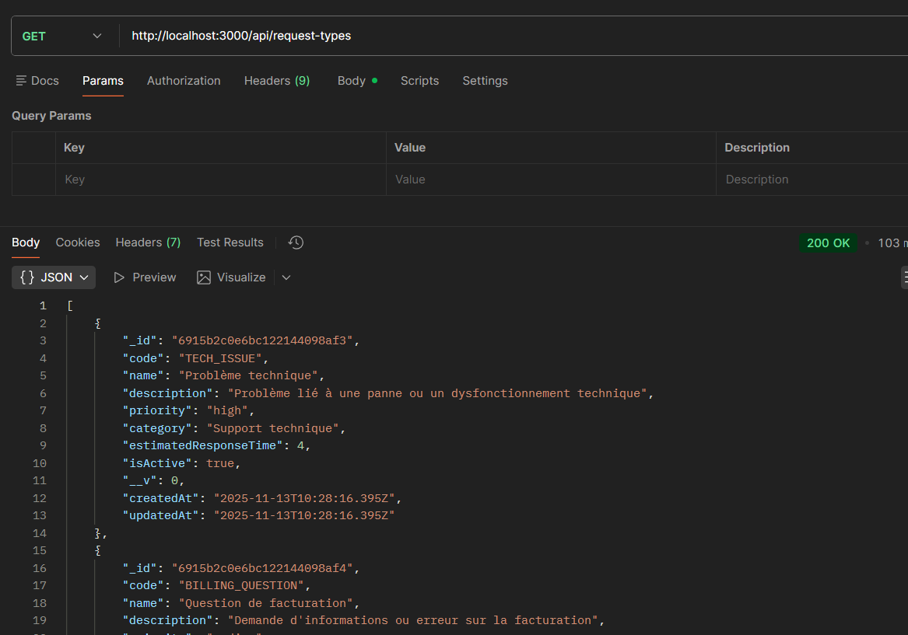
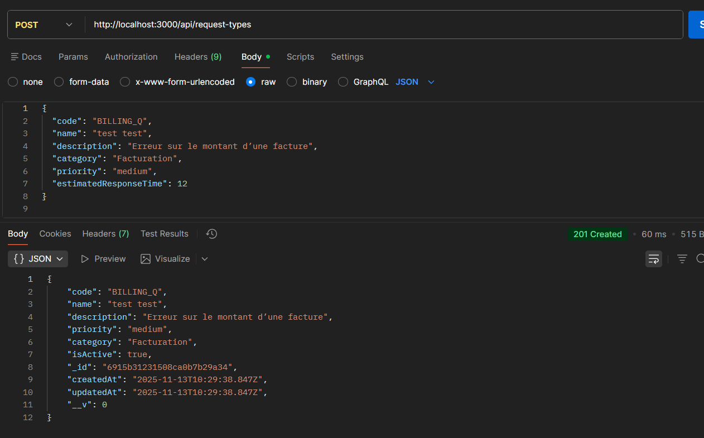
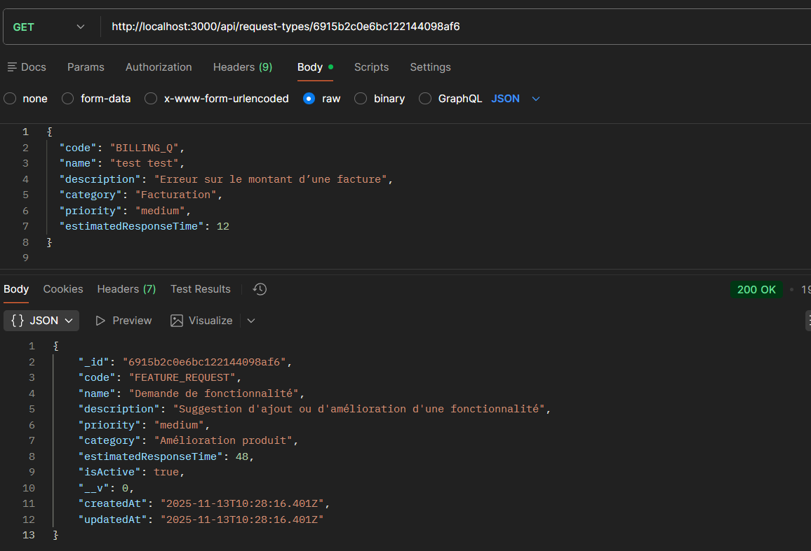

# README – TP Final Git

## 1. WORKFLOW GIT

- **1.1. Organisation du workflow**

Le projet utilise un workflow Git professionnel simple, basé sur des branches
fonctionnelles (feature branches) et des Pull Requests obligatoires.

Workflow utilisé :

```bash
main
│
├── feature/setup
│     - Structure du projet
│     - ESLint, Prettier, CI/CD
│
├── feature/content
│     - Modèle RequestType
│     - Routes API complètes
│     - Script seed
│     - Tests unitaires / validation
│
└── feature/integration-tests-et-docs
      - SuperTest (tests d’intégration)
      - README complet
```

- **1.2. Règles de protection de la branche main (IMPORTANT – demandé dans le TP)**

La branche "main" a été entièrement verrouillée.
L'objectif est d'empêcher toute dégradation du code ou du projet.

Voici les protections appliquées :

✔ Push direct sur main interdit  
✔ Merge uniquement via Pull Request  
✔ Deux checks CI obligatoires avant merge : - Code Quality (ESLint + Prettier) - Tests (Jest + couverture ≥ 70 %)
✔ "Require branches to be up to date before merging"
✔ "Require a Pull Request before merging"
✔ Interdiction pour les administrateurs de contourner les règles
✔ Revue du code obligatoire (1 reviewer minimum)
✔ Empêcher la suppression de la branche main

Grâce à ces règles :

- Toute modification doit obligatoirement passer par une PR
- Le code doit obligatoirement "passer la CI"
- On garantit une qualité de code permanente




- **1.3. Comment créer une Pull Request**

1. Créer une branche :

```bash
   git checkout -b feature/nom-de-ta-feature
```

2. Faire les modifications

3. Commit + push :

```bash
   git add .
   git commit -m "feat: description"
   git push origin feature/..."
```

4. Aller sur GitHub → "Compare & pull request"

5. Vérifier que tous les checks CI sont verts

6. Cliquer sur "Merge Pull Request"



## 2. CI/CD

- **2.1. Badge du statut de la CI**


- **2.2. Description des jobs configurés**

La CI se compose de deux jobs obligatoires :

### Job 1 : Code Quality

- Installation des dépendances
- Exécution d’ESLint
- Vérification du formatage avec Prettier

But : empêcher un code mal écrit ou mal formaté.

### Job 2 : Tests (Jest + SuperTest)

- Lancement d’une base MongoDB en mode service
- Installation des dépendances
- Exécution de Jest avec couverture (> 70 %)

But : empêcher tout merge si les tests échouent.

- **2.3. Required Checks**

Les deux checks suivants doivent OBLIGATOIREMENT être verts :

- Code Quality
- Tests




## 3. INSTALLATION & UTILISATION

- **3.1. Prérequis**

- Node.js 18+
- Docker + Docker Compose
- npm

- **3.2. Installation du projet**

1. Installer les dépendances :

```bash
   npm install
```

2. Lancer MongoDB :

```bash
   docker compose up -d
```

3. Seed de la base :

```bash
   node scripts/seed.js
```

- **3.3. Variables d'environnement (.env)**

```bash
PORT=
NODE_ENV=

MONGODB_URI=
MONGO_USER=
MONGO_PASS=
MONGO_DB=
```

- **3.4. Commandes disponibles**

```bash
npm run dev          → lance l’API avec nodemon
npm run lint         → vérifie ESLint
npm run lint:fix     → corrige ESLint
npm run format       → applique Prettier
npm run format:check → vérifie Prettier
npm test             → Jest + coverage
```

- **3.5. Exemples d'appels API**

GET /api/health

```bash
→ { "status": "ok" }
```

POST /api/request-types

```bash
{
  "code": "TECH_ISSUE",
  "name": "Problème technique",
  "description": "Erreur critique",
  "priority": "high",
  "category": "Support"
}
```

Get :


---

Post :


---

Get by ID :


## 4. STRUCTURE DU PROJET

Arborescence :

```bash
TP-Final-Git/
│
├── src/
│   ├── config/
│       └── database.js                 → connexion MongoDB
│   ├── models/
│       └── RequestType.js              → schéma RequestType
│   ├── routes/
│       └── requestTypes.js             → routes Express
│   └── server.js                       → serveur Express
│
├── tests/                              → tests Jest + SuperTest
├── scripts/
│       └── seed.js                     → seed de la base de données
├── .github/workflows/ci.yml
├── .eslintrc
├── eslint.config.mjs
├── .prettierrc
├── .gitignore
├── docker-compose.yml
├── .env
├── package-lock.json
├── package.json
└── README.md
```

## Credit

Développer par Nolhan Marteau durant sa 3ème année à l'ESGI dans le cadre d'un cours de versionning GitHub
